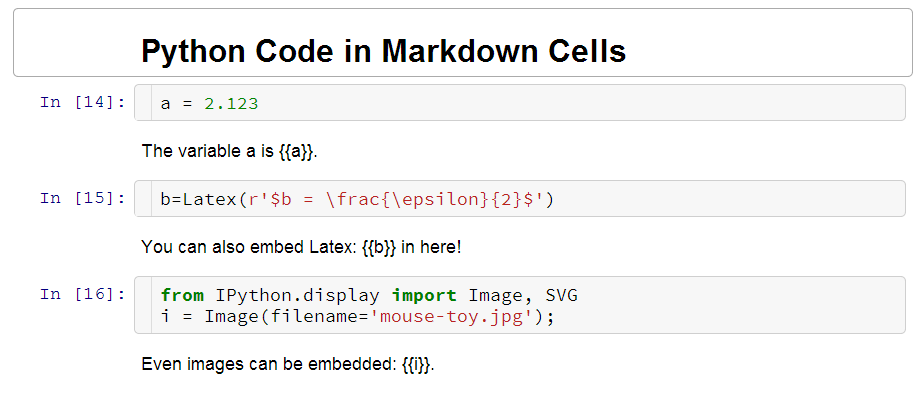
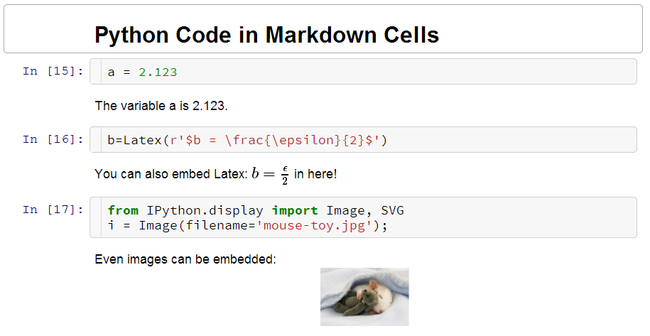

This extension allows dynamically displaying Python variables in markdown cells.
Example:
If you set variable `a` in Python

```Python
a = 1.23
```

and write the following line in a markdown cell:

```Markdown
a = {{a}}
```

It will be displayed as:

```Markdown
a = 1.23
```

[](https://youtu.be/_wLwLsgkExc)


Further examples
----------------

Before rendering the markdown cell:


After rendering the markdown cell:


Python code is only executed when the notebook is trusted. So if your original Python code is still shown in rendered markdown output, please make sure your notebook is trusted.

**Caution:** There is no restriction in the expression you can embedd in `{{ }}`. Be careful as you might crash your browser if you return too large datasets.

Also, images in markdown will be removed due to the HTML sanitizer after a reload.


Installation
============

Install the master version of the IPython-notebook-extensions repository as explained on the main wiki page.

Then load the extension from within the IPyton notebook:

```javascript
%%javascript
IPython.load_extensions('IPython-notebook-extensions-master/usability/python-markdown/main');
```

In order to have `nbconvert` show the preprocessed output, copy the `pymdpreprocessor.py` file to a location in your `PYTHONPATH`and add or extend the following line to your `ipython_nbconvert_config.py` configuration file:
`c.Exporter.preprocessors = [ 'pymdpreprocessor.PyMarkdownPreprocessor' ]`


Internals
=========

The extension overrides the `textcell.MarkdownCell.prototype.render` function and searches for a Python expression enclosed in double curly braced `{{ <expr> }}`. It then executes the expression and replaces it with the result returned from Python, embedded in a `<span>` tag.
Additionally, the result is saved in the metadata of the markdown cell, i.e. `cell.metadata.variables[varname]`. This stored value is displayed when reloading the notebook and used for the nbconvert preprocesser.

The preprocessor `pymdpreprocessor.PyMarkdownPreprocessor` allows `nbconvert` to display the computed variables when converting the notebook to an output file format.
